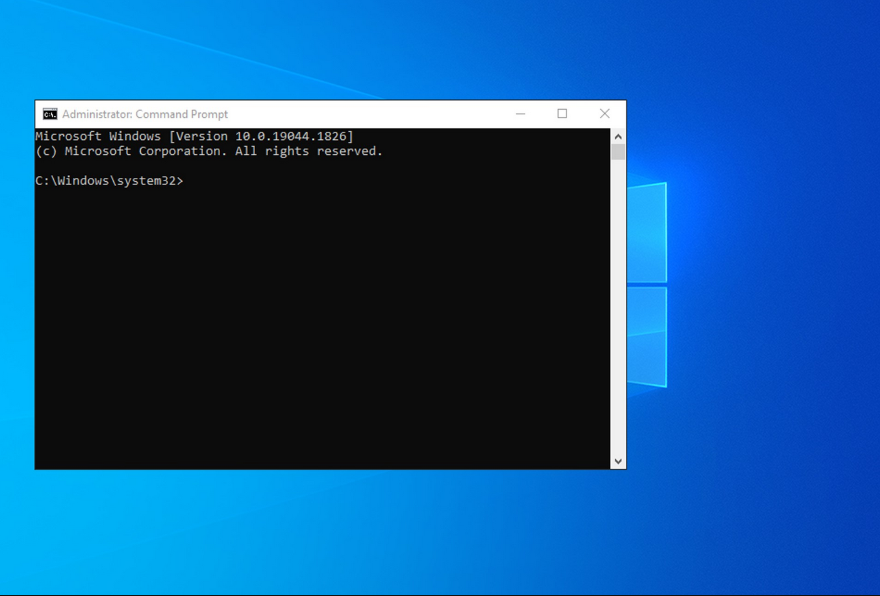
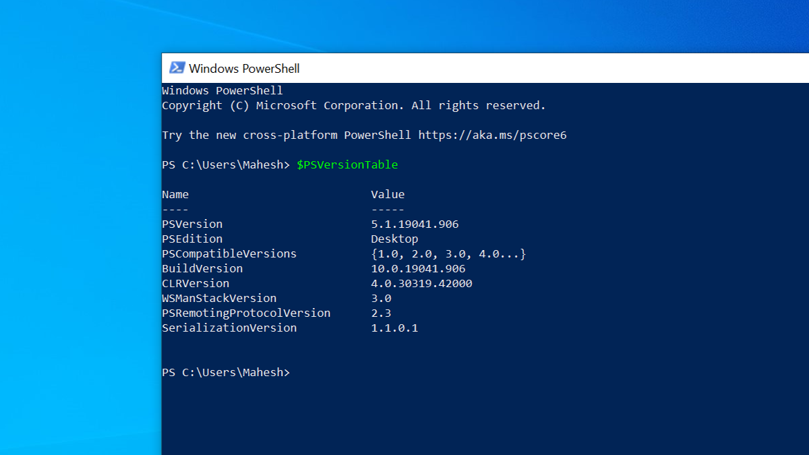
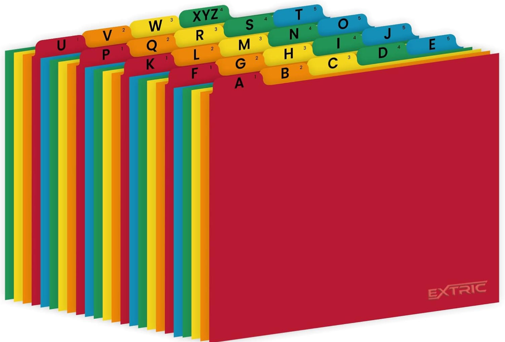

---
theme:
    override:
        code:
            theme_name: railsEnvy
        default:
            colors:
                background: "10141c"
---
<!-- column_layout: [2,3] -->
<!-- column: 0 -->
<!-- jump_to_middle -->
# **Object Oriented Programming**

Mitsiu Alejandro Carreño Sarabia
<!-- column: 1 -->
<!-- jump_to_middle -->


<!-- reset_layout -->

<!-- end_slide -->

Agenda
---
├── Slides intro     
├── Course intro      
├── Generalities    
├── Tests     
└── Homework    
<!-- end_slide -->

<!-- jump_to_middle -->
# Slides intro
---
<!-- end_slide -->

# Slides intro
---
Code snippets will be shown with highlight and execution:
```python +line_numbers {all|1|2-7|9|all} +exec
def fib(n):    # Function definition
    """Print a Fibonacci series less than n."""
    a, b = 0, 1
    while a < n:
        print(a, end=' ')
        a, b = b, a+b
    print()

fib(2000)   # Call fib function with parameter 2000 
```

<!-- end_slide -->

# Slides intro
---
At the bottom of my screen you'll see two tabs ```"Slides"``` & ```"Terminal"``` the active tab is marked in green

The terminal window is a powerfull tool which will allow us to execute commands and programs, `you are required to learn how to use the terminal`
<!-- column_layout: [1,1] -->
<!-- column: 0 -->

CMD 
<!-- column: 1 -->

Powershell
<!-- reset_layout -->
<!-- end_slide -->

# Slides intro
---
I personally prefer text-based rather than graphical interfaces, it's faster!
<!-- column_layout: [1,1] -->
<!-- column: 0 -->
* Mis-clicks
* Loose the cursor
* Time spent to move coursor
<!-- column: 1 -->

<!-- reset_layout -->
So I rarely use it.

You can use any editor or environment which suits you, I encourage you to `learn your tools` so you can set them up for your use and confort.
<!-- end_slide -->
# Slides intro
---
All this slides will be shared, as well as source code and extra material so here's my recommendation:
- Take hand written notes in a notebook
- Write down definitions
- Write down examples or analogies which makes sense to you
- Write down diagrams

<!-- end_slide -->

<!-- jump_to_middle -->
## Course intro      
---
<!-- end_slide -->

## Course intro      
---
- Why this career?
<!-- pause -->
- Do you enjoy writting code?
<!-- pause -->
- Which is the most complex program you've written?
<!-- pause -->
- Which programming languages do you know? Favourite?
<!-- pause -->
- Which editor/tools do you use to write code?
<!-- pause -->
- Do you know what is git?
<!-- pause -->
- Which Operating system do you use?
<!-- pause -->
- Which Operating system did you use on yout OS class las quarter?
<!-- pause -->
- What's your opinion on tech certificates?
<!-- pause -->
- `Do you enjoy reading?` (Not limited to books)
<!-- pause -->
- To whom do you write code to?
<!-- end_slide -->

## Course intro      
---
Object oriented programming is a programming model which uses objects, linked via functions, to solve problems. The main idea is simple: `organize programs` in the image and likeness of the organization of real objects in the world



<!-- end_slide -->
## Course intro      
---
Let's focus on `organizing` which is the best way to organize the material (source code, notes, slides, etc) you've archived during the career?
<!-- column_layout: [2,3,3] -->
<!-- column: 0 -->
- By course

├── English I    
├── OS      
└── Calculus         
<!-- column: 1 -->
- By period (four-month period)

├── Q1     
│   └── English I   
├── Q2      
│   ├── OS     
│   └── Calculus     
└── Q3     
&nbsp;&nbsp;&nbsp;&nbsp;└── OOP    
<!-- column: 2 -->
- By type (eg /Slides, /Homeworks /Source code)

├── Slides     
│   ├── OS     
│   └── Calculus     
├── Homework    
│   ├── English I     
│   └── Calculus     
└── SourceCode    
&nbsp;&nbsp;&nbsp;&nbsp;└── OOP    
<!-- pause -->
<!-- reset_layout -->
Which is best?
<!-- end_slide -->

## Course intro      
---
In my opinion there's no general `best` way, it depends on what's to optimize
- By course is best if we want to search but are unsure of the period
- By period is best if we want to search chronologically
- By type is best of we want to seach if we dont remember the course/period it belong to
<!-- end_slide -->

## Course intro      
---
In a similar fashion there are multiple way's to organize and structure our source code, each with it's own strengths and weaknesses
- Structured programming: Code execution is seen as sequential best fit for simple flows
- `Object Oriented`: Code is organized as objects each with a set of atributes and methods, best fit for multi-entity programs
- Functional: Code is organized into pure functions without state, best fit for crital and secure code execution
- Data Oriented: Code is organized based on physical locallity, best fit for execution performance
<!-- end_slide -->

## Course intro      
# Defitions:
---
Object Oriented Programming is a `paradigm`      
**Paradigm**
1. Noun. A model of something, or a very clear and `typical example of something`
> A theory or set of theories whose central core is accepted without question and which `provides the basis and model for solving problems` and advancing knowledge.

<!-- pause -->
**Programming paradigm**
1. A high level model to `conceptualize and structure` a computer program implementation 
<!-- end_slide -->

## Course intro      
# Defitions:
---
**Implementation**
> The process of moving an idea `from concept to reality`
<!-- end_slide -->

## Course intro      
---
<!-- column_layout: [1,2] -->
<!-- column: 0 -->
Are this "implementations" in the room with us right now?

<!-- pause -->
<!-- column: 1 -->
YES!
**Implemetation to get the Fibonacci series**
<!-- pause -->
```python +line_numbers
def fib(n):    # Function definition
    """Print a Fibonacci series less than n."""
    a, b = 0, 1
    while a < n:
        print(a, end=' ')
        a, b = b, a+b
    print()

fib(2000)   # Call fib function with parameter 2000 
```
<!-- reset_layout -->
<!-- end_slide -->

<!-- jump_to_middle -->
### Generalities
---
<!-- end_slide -->

### Generalities
---
Requirements:

**Mandatory:**
- Computer
- Master your source code editor
- Master programming fundamentals (variables, if, for, functions)
- Commitment
- Computers ready to share (adapters)

**Optional but recommended:**
- Physical notebooks
- Get a lot of tokens
- Disable AI assistants (copilot, chatgpt, etc)
- Disable autocompletion in your editor

<!-- end_slide -->
### Generalities
---
Formal definitions have this format:
> Formal definition: Explains the concept at an academic level (descriptions found in books, articles, official documentation etc)

<!-- pause -->
Formal definitions might be a little abstract or lack context explanations

So:

- In this slides you'll find informal definitions `coloured red` to explain the same concept in easier words

The ideal solution is for you to understand informal definitions as context for the formal definitions, use both to solve tests
<!-- end_slide -->

<!-- jump_to_middle -->
#### Tests
---
<!-- end_slide -->

#### Tests
---
Most tuesdays we'll have one of the following tests:
1. **Weekly test**
- Are solved by hand
- Have NO grade value
- Perfect score is traded for 2 tokens

2. **Partial test**
- 1st Partial = 30%
- 2nd Partial = 30%
- 3rd Partial = 40%
<!-- end_slide -->

#### Tests
---
**Partial test**
- 1st Partial = 30%
- - Theorical evaluation = 50%
- - Practical evaluation (paper based, NO computer) = 50%
- 2nd Partial = 30%
- - Theorical evaluation = 40%
- - Practical evaluation (paper based, NO computer) = 60%
- 3rd Partial = 40%
- - Theorical evaluation = 40%
- - Practical evaluation (paper based, NO computer) = 60%

<!-- end_slide -->

<!-- jump_to_middle -->
##### Homework
---
<!-- end_slide -->

##### Homework
---
**Master your code editor:**
<!-- column_layout: [1,1] -->
<!-- column: 0 -->
- Search in a single file
- Search in multiple files
- Know filename and file path of open file
<!-- column: 1 -->
- Go to definition
- Split screen
- Go to a specific line in a file
- Find and replace in a single file
- Find and replace in multiple files
<!-- reset_layout -->
<!-- column_layout: [1,1] -->
<!-- column: 0 -->
**Bring your computer next session**       

**Master how to keypress () [] {}**
<!-- column: 1 -->
**Upskill your english**

**Practice PascalCase with shift key**
<!-- reset_layout -->
<!-- end_slide -->

<!-- jump_to_middle -->
###### References
---
<!-- end_slide -->

###### References
---
PROGRAMACIÓN ORIENTADA A OBJETOS CON C++. Ceballos, 5th EDITION. (2018).
https://dle.rae.es/paradigma?m=form
https://dictionary.cambridge.org/dictionary/english/paradigm
