---
theme:
    override:
        code:
            theme_name: railsEnvy
        default:
            colors:
                background: "10141c"
---
<!-- column_layout: [2,3] -->
<!-- column: 0 -->
<!-- jump_to_middle -->
# **Linters & Formatters**

Mitsiu Alejandro Carreño Sarabia
<!-- column: 1 -->
<!-- jump_to_middle -->
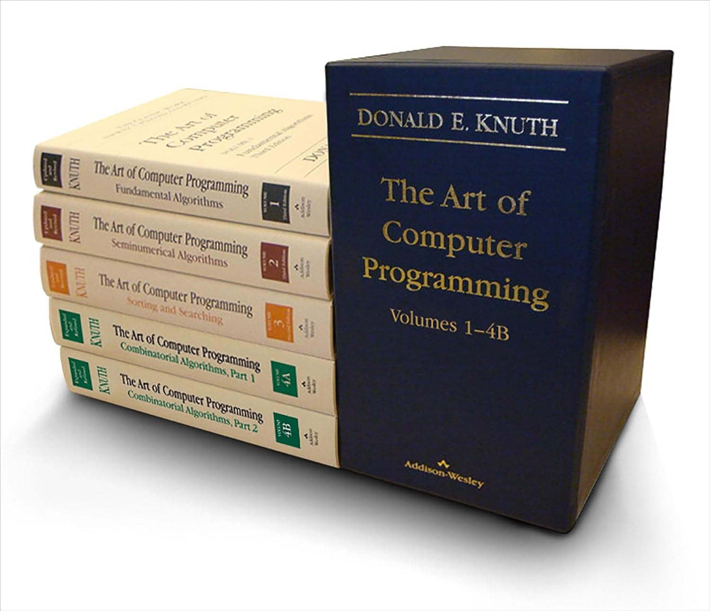

<!-- reset_layout -->

<!-- end_slide -->

Agenda
---
├── Formatters     
├── Linters      
├── Formatters & linters     
├── Name conventions      
├── Java implementation    
└── Examples    
<!-- end_slide -->

# Formatters
---
Coding style is `how your code looks` and it is an important part of writing code as a professional. Whether you’re writing JavaScript or CSS or any other language, deciding how your code should look `is an important part of overall code quality`.

<!-- pause -->
- Who we write code for?

<!-- end_slide -->

# Formatters
---
<!-- column_layout: [1,1] -->
<!-- column: 0 -->
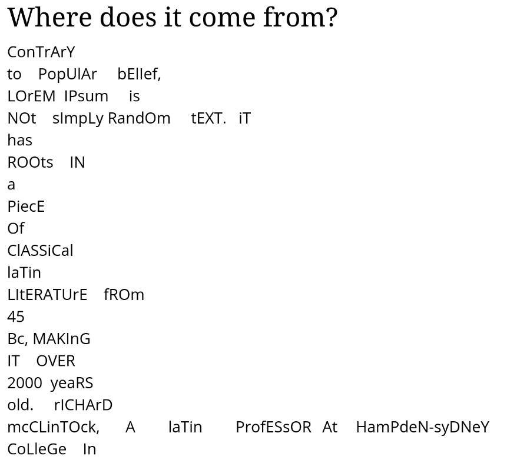
<!-- column: 1 -->
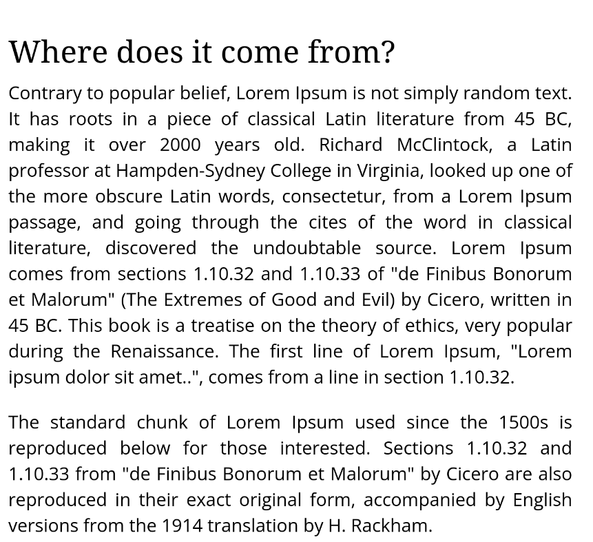
<!-- reset_layout -->
<!-- end_slide -->

# Formatters
---
Coding style is made up of numerous small decisions based on the language:
- How and when to use comments,
- Tabs or spaces for indentation (and how many spaces),
- Appropriate use of white space,
- Proper naming of variables and functions,
- Code grouping an organization,
- Patterns to be used,
- Patterns to be avoided.

<!-- end_slide -->

## Linters
---
Lint is the computer science term for a `static code analysis tool` used to `flag programming errors, bugs, stylistic errors and suspicious constructs`.

<!-- end_slide -->

### Formatter & linter
---
<!-- column_layout: [4,3] -->
<!-- column: 0 -->
Formatting rules
- Maximum line length
- Disallow mixed spaces and tabs for indentation
- Enforce consistent spacing before and after keywords
- Enforce consistent comma style
- Etc
<!-- pause -->
<!-- column: 1 -->
Code-quality rules
- Disallow unused variables
- Disallow declarations in the global scope
- Branching fall through
- Etc
<!-- reset_layout -->

In summary, `formatters applies code style rules` and `linter detect logic errors`.
<!-- end_slide -->

#### Name conventions
---
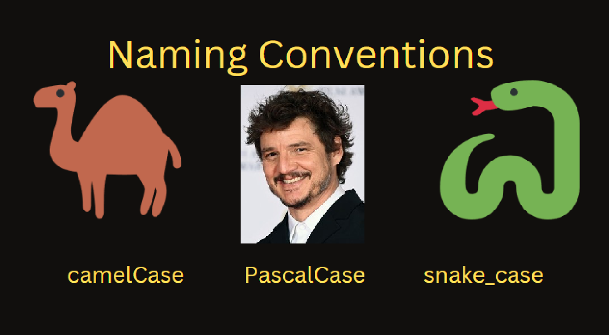
<!-- end_slide -->

#### Name conventions
---
<!-- column_layout: [1,1] -->
<!-- column: 0 -->
- Variables => cammelCase
```java +line_numbers {all}
String nombre = "POO"
String nombreMateria = "POO"
```
- Functions => cammelCase
```java +line_numbers {all}
static void printGreet(){
    ...
}
```
<!-- column: 1 -->
- Parameters => cammleCase
```java +line_numbers {all}
static int addTwo(int firstNum){
    return firstNum + 2;
}
```
- Clases => PascalCase
```java +line_numbers {all}
class MyClass {
    ...
}
```
<!-- reset_layout -->

<!-- end_slide -->

##### Java implementation    
--- 
What is implementation?
<!-- end_slide -->

##### Java implementation    
# Terminal review A) VS Code
--- 
**VS code**
<!-- column_layout: [1,1] -->
<!-- column: 0 -->
- Open the folder in vs code

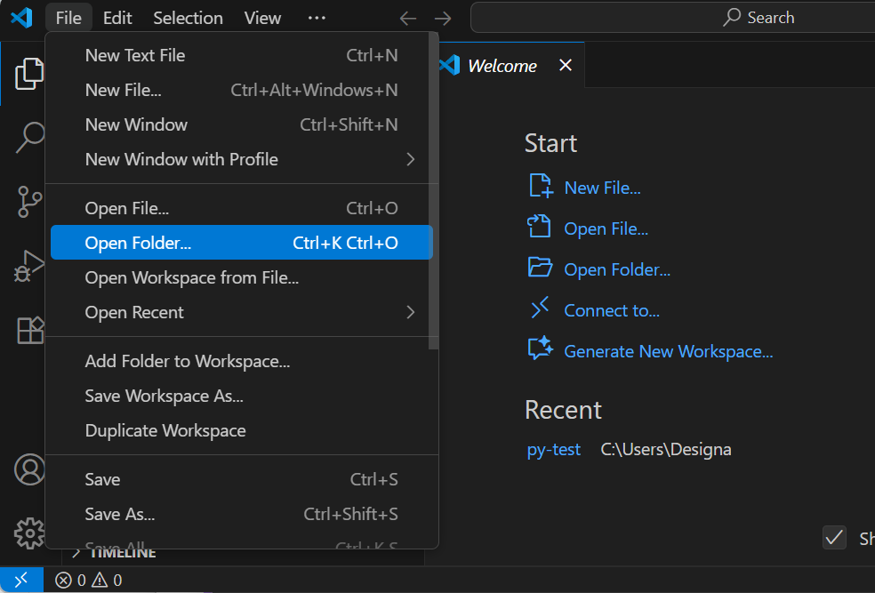

<!-- column: 1 -->
- Open a new terminal

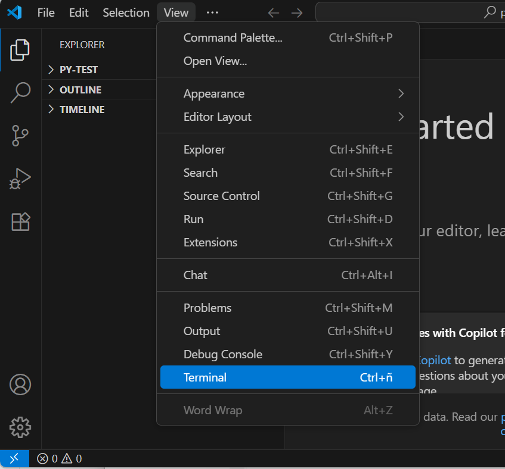
<!-- reset_layout -->
<!-- end_slide -->

##### Java implementation    
# Terminal review A) VS Code
--- 
- Choose between Powershell or cmd

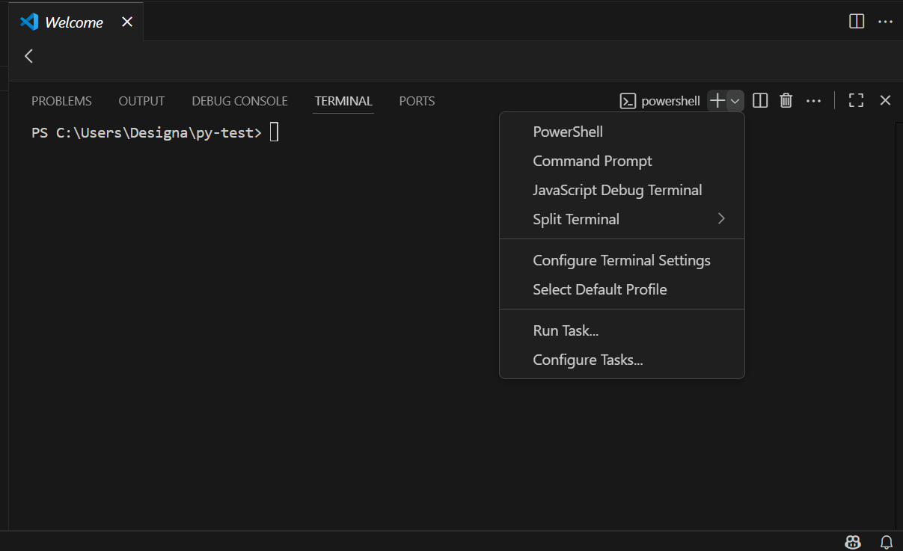

<!-- end_slide -->

##### Java implementation    
# Terminal review B) File explorer PS
--- 
**File explorer and Powershell**
<!-- column_layout: [2,1] -->
<!-- column: 0 -->
- Secondary click "Abrir en terminal"

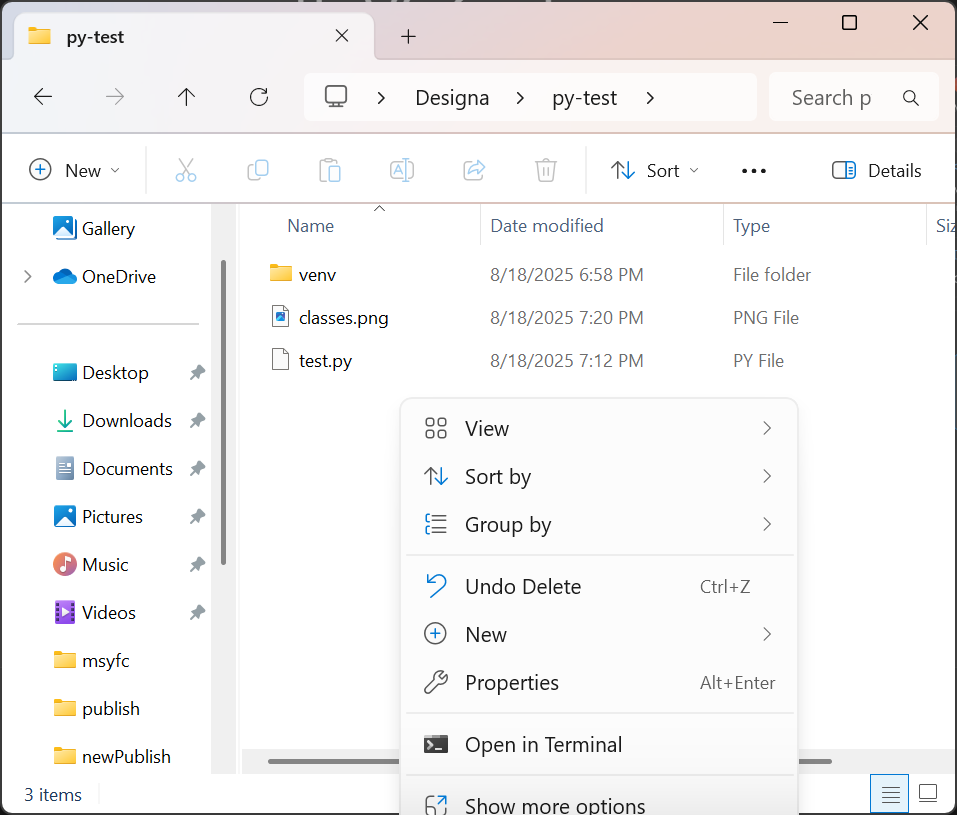
<!-- column: 1 -->
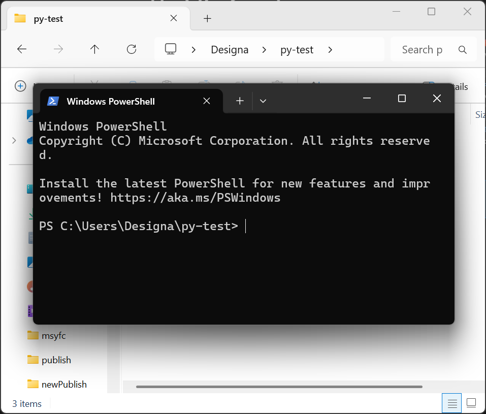
<!-- reset_layout -->

<!-- end_slide -->

##### Java implementation    
# Terminal review C) File explorer cmd
--- 
**File explorer and cmd**
<!-- column_layout: [1,1] -->
<!-- column: 0 -->
- Click path bar

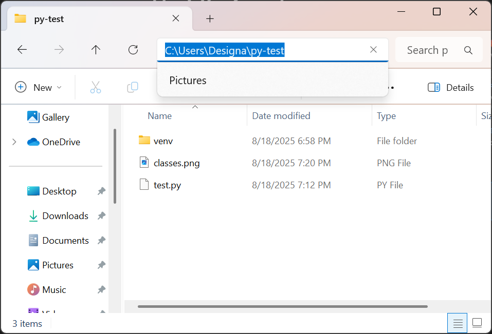
<!-- column: 1 -->
- Erase current path and write "cmd"

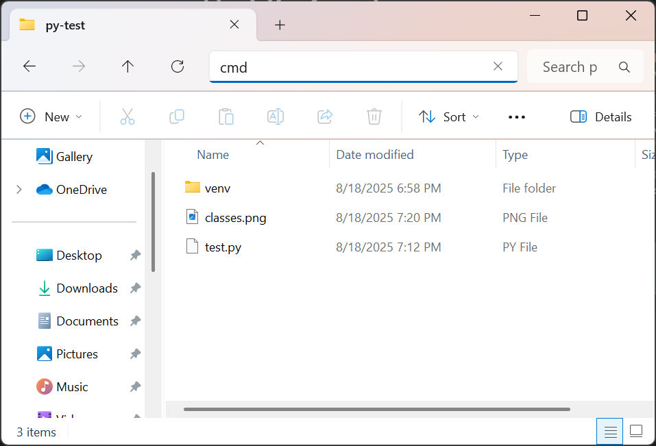
<!-- reset_layout -->

<!-- end_slide -->

##### Java implementation    
# Terminal review C) File explorer cmd
--- 
**File explorer and cmd**
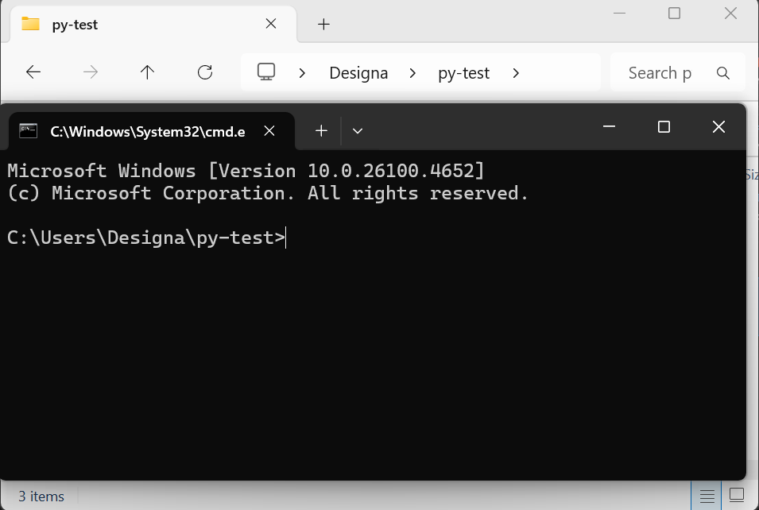
<!-- end_slide -->

##### Java implementation    
--- 
<!-- column_layout: [1,1] -->
<!-- column: 0 -->
1. You need to know the file path to your \<file\>.java
2. You need to download `checkstyle-11.0.1-all.jar` (https://github.com/checkstyle/checkstyle/releases/) 
<!-- column: 1 -->
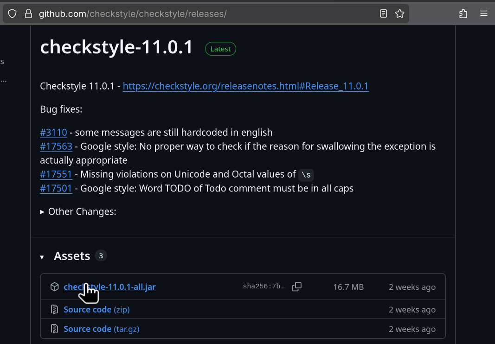
<!-- reset_layout -->
<!-- end_slide -->
##### Java implementation    
--- 
3. Download `google_checks.xml` (https://github.com/checkstyle/checkstyle/blob/master/src/main/resources/google_checks.xml)      

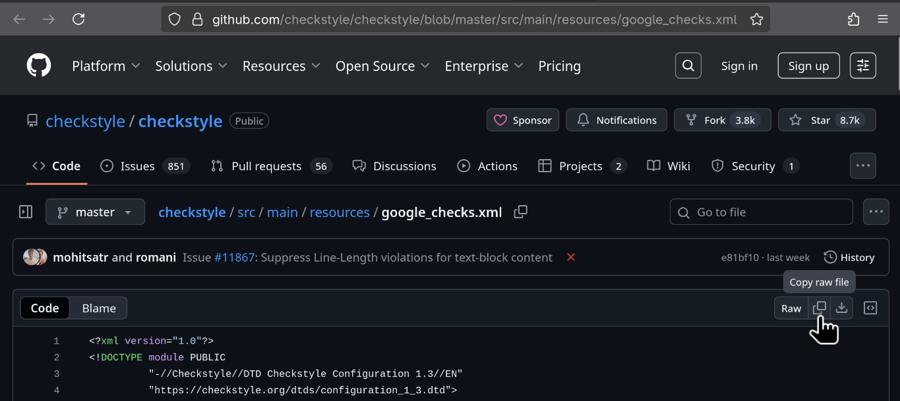
<!-- end_slide -->

##### Java implementation    
--- 
4. All files should be in the same directory:
    - \<file\>.java
    - checkstyle-11.0.1-all.jar
    - google_checks.xml

<!-- end_slide -->

##### Java implementation    
--- 
Terminals ofter feature `autocompletion via tab`
```bash +line_numbers {all}
java -jar checkstyle-11.0.1-all.jar -c google_checks.xml <file>.java 
```
<!-- end_slide -->

###### Examples
```java +line_numbers {all}
class e9Checkstyle {
    ...
}
```
E9Checkstyle.java:1:7: Type name 'e9Checkstyle' must match pattern '^[A-Z][a-zA-Z0-9]*$'. [TypeName]
<!-- pause -->
```java +line_numbers {all}
class E9Checkstyle {
    ...
}
```
<!-- end_slide -->

###### Examples
```java +line_numbers {all}
// File: e9Checkstyle.java
class E9Checkstyle {
    ...
}
```
e9Checkstyle.java:1:1: The name of the outer type and the file do not match. [OuterTypeFilename]
<!-- pause -->
```java +line_numbers {all}
// File: E9Checkstyle.java
class E9Checkstyle {
    ...
}
```
<!-- end_slide -->

###### Examples
```java +line_numbers {all}
class E9Checkstyle {
public static void main(String[] args) {
    ...
}
}
```
E9Checkstyle.java:2:1: 'method def modifier' has incorrect indentation level 0, expected level should be 2. [Indentation]        
E9Checkstyle.java:4:1: 'method def rcurly' has incorrect indentation level 0, expected level should be 2. [Indentation]
<!-- pause -->
```java +line_numbers {all}
class E9Checkstyle {
    public static void main(String[] args) {
        ...
    }
}
```
<!-- end_slide -->

###### Examples
```java +line_numbers {all}
class E9Checkstyle {
    public static void main(String[] args){
        ...
    }
}
```
E9Checkstyle.java:2:41: WhitespaceAround: '{' is not preceded with whitespace. [WhitespaceAround]
<!-- pause -->
```java +line_numbers {all}
class E9Checkstyle {
    public static void main(String[] args) {
        ...
    }
}
```
<!-- end_slide -->

###### Examples
```java +line_numbers {all}
class E9Checkstyle {
    public static void main(String[] Args) {
        ...
    }
}
```
E9Checkstyle.java:2:36: Parameter name 'Args' must match pattern '^[a-z]([a-z0-9][a-zA-Z0-9]*)?$'. [ParameterName]
<!-- pause -->
```java +line_numbers {all}
class E9Checkstyle {
    public static void main(String[] args) {
        ...
    }
}
```
<!-- end_slide -->


###### Resources
---
https://google.github.io/styleguide/javaguide.html
https://github.com/checkstyle/checkstyle/releases/
https://github.com/checkstyle/checkstyle/blob/master/src/main/resources/google_checks.xml

###### References
---
https://web.archive.org/web/20230606032819/http://www.sublimelinter.com/en/v3.10.10/about.html
https://prettier.io/docs/comparison
https://www.smashingmagazine.com/2012/10/why-coding-style-matters/
