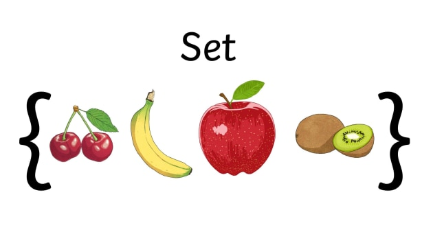
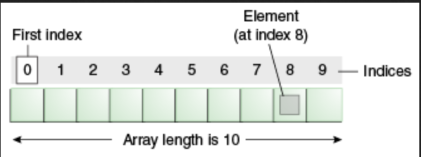

---
theme:
    override:
        code:
            theme_name: railsEnvy
        default:
            colors:
                background: "10141c"
---
<!-- column_layout: [2,3] -->
<!-- column: 0 -->
<!-- jump_to_middle -->
# **Arrays**

Mitsiu Alejandro Carreño Sarabia
<!-- column: 1 -->
<!-- jump_to_middle -->

<!-- reset_layout -->

<!-- end_slide -->

Agenda
---
├── Concepts     
├── Data types      
├── Arrays    
├── Magic Words?         
└── Intro POO      
&nbsp;&nbsp;&nbsp;&nbsp;├── Scenario    
&nbsp;&nbsp;&nbsp;&nbsp;├── Object oriented solution     
&nbsp;&nbsp;&nbsp;&nbsp;└── Classes       
<!-- end_slide -->

# Concepts
---
**Programming paradigm**
1. A high level model to `conceptualize and structure` a computer program implementation 

**Implementation**
> The process of moving an idea `from concept to reality`

<!-- end_slide -->

## Data types
---
<!-- column_layout: [1,2] -->
<!-- column: 0 -->
**Primitives**
- byte = 0
- short = 0
- int = 0
- long = 0L
- float = 0.0f
- double = 0.0d
- boolean = false
- char = '\u0000'
- *String = null
<!-- column: 1 -->
**Arrays**      
\<type>[] \<nombreVar> = new \<type>[\<size>]
```java +line_numbers {all}
// Declares an array of integers
int[] myArray;

// allocates memory for 10 integers
myArray = new int[10];
```

<!-- reset_layout -->
<!-- end_slide -->

### Arrays
---
**Arrays**      
\<type>[] \<nombreVar> = new \<type>[\<size>];
```java +line_numbers {all}
// Declares an array of integers
int[] myArray;

// allocates memory for 10 integers
myArray = new int[10];
```
When do we use `new`?
<!-- pause -->
> new
> A Java keyword used to create an instance of a class. 

<!-- end_slide -->

### Arrays
---
<!-- jump_to_middle -->
How can we create an array to store everybody name's?
```java +line_numbers {all}
int[] myArray = new int[10];

myArray[0] = 3;

System.out.print("El primer integer en el arreglo es: " + myArray[0]);
```

<!-- end_slide -->

#### Magic words?
---
<!-- jump_to_middle -->
What does the keywords in function main mean?

```java +line_numbers {all}
class Demo {
    public static void main(String[] args){
        ...
    }
}
```
<!-- end_slide -->

###### References
---
https://docs.oracle.com/javase/tutorial/java/nutsandbolts/arrays.html
