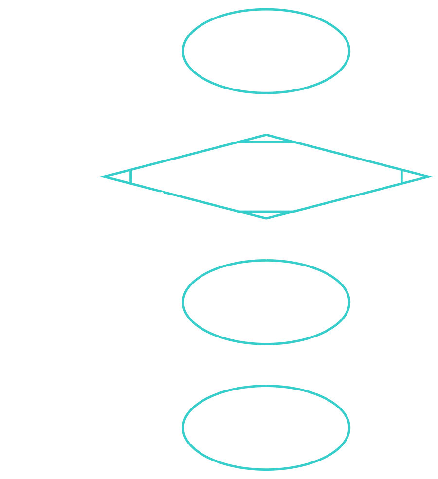
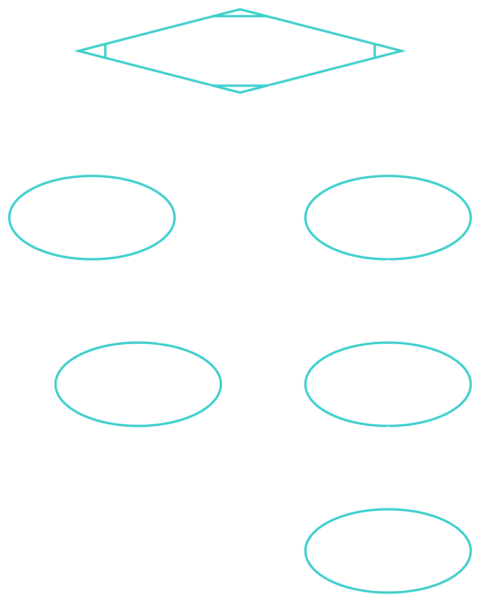

---
theme:
    override:
        code:
            theme_name: railsEnvy
        default:
            colors:
                background: "10141c"
---
<!-- column_layout: [1,1] -->
<!-- column: 0 -->
<!-- jump_to_middle -->
# **Java sintax and programming structures**

Mitsiu Alejandro Carreño Sarabia
<!-- column: 1 -->

<!-- reset_layout -->

<!-- end_slide -->

Agenda
---
├── If     
│   ├── If-else     
│   ├── If-else if     
│   └── If-else if-else      
├── For-each         
│   ├── Break     
│   └── Continue      
├── While         
├── Functions         
│   └── Parameters      
└── Notes
<!-- end_slide -->

# If (branching)
---
<!-- column_layout: [1,1] -->
<!-- column: 0 -->
```java +line_numbers {all}
Expr 1
if (cond) {
    Expr 2
}
Expr 3
```
<!-- column: 1 -->

<!-- reset_layout -->
<!-- end_slide -->

# If (branching)
---
If it's false it jumps Expr 2
<!-- column_layout: [1,1] -->
<!-- column: 0 -->

<!-- column: 1 -->

<!-- reset_layout -->
<!-- end_slide -->

# If-else
---
<!-- column_layout: [1,1] -->
<!-- column: 0 -->
```java +line_numbers {all}
Expr 1
if (cond) {
    Expr 2
} else {
    Expr 3
}
Expr 4
```
<!-- column: 1 -->

<!-- reset_layout -->
<!-- end_slide -->

# If-else
---
Always jumps an expression
<!-- column_layout: [1,1] -->
<!-- column: 0 -->

<!-- column: 1 -->

<!-- reset_layout -->
<!-- end_slide -->

# If-else if
---
<!-- column_layout: [1,1] -->
<!-- column: 0 -->
```java +line_numbers {all}
Expr 1
if (cond 1) {
    Expr 2
} else if (cond 2) {
    Expr 3
}
Expr 4
```
<!-- column: 1 -->

<!-- reset_layout -->
<!-- end_slide -->

# If-else if
---
- Either Expr 2 or Expr 3 or none
<!-- column_layout: [1,1,1] -->
<!-- column: 0 -->

<!-- column: 1 -->

<!-- column: 2 -->

<!-- reset_layout -->
<!-- end_slide -->

# If-else if-else
---
<!-- column_layout: [1,1] -->
<!-- column: 0 -->
```java +line_numbers {all}
Expr 1
if (cond 1) {
    Expr 2
} else if (cond 2) {
    Expr 3
} else {
    Expr 4
}
Expr 5
```
<!-- column: 1 -->

<!-- reset_layout -->
<!-- end_slide -->

# If-else if-else
---
- Condition 2 it's just a regular if-else (Expr 3 or Expr 4)
- Condition 1 it's just a regular if-else (Expr 2 or Cond 2)
- Between Expr 2, Expr 3 and Expr 4 only one will execute
<!-- column_layout: [1,1,1] -->
<!-- column: 0 -->

<!-- column: 1 -->

<!-- column: 2 -->

<!-- reset_layout -->
<!-- end_slide -->

# For-each (Archivo: ./assets/gviz/for-in.gif)
---
<!-- column_layout: [1,1] -->
<!-- column: 0 -->
```java +line_numbers {all}
String[] conjunto = 
    {"A", "B", "C", "D"};

for (String element : conjunto){
    Expr 1
}
Expr 2
```
<!-- column: 1 -->

<!-- reset_layout -->
<!-- end_slide -->

# For-each break (Archivo: ./assets/gviz/for-in-break.gif)
---
<!-- column_layout: [1,1] -->
<!-- column: 0 -->
```java +line_numbers {all}
String[] conjunto = 
    {"A", "B", "C", "D"};

for (String element : conjunto){
    Expr 1
    if (Cond 1) {
        break;
    }
    Expr 2
Expr 3
```
<!-- column: 1 -->

<!-- reset_layout -->
<!-- end_slide -->

# For-each break (Archivo: ./assets/gviz/for-in-break.gif)
---
<!-- column_layout: [1,1] -->
<!-- column: 0 -->
- Let's suppose that condition is true when element is C
- Our loop `does NOT` reach element D
<!-- column: 1 -->

<!-- reset_layout -->
<!-- end_slide -->

# For-each continue (Archivo: ./assets/gviz/for-in-cont.gif)
---
<!-- column_layout: [1,1] -->
<!-- column: 0 -->
```java +line_numbers {all}
String[] conjunto = 
    {"A", "B", "C", "D"};

for (String element : conjunto){
    Expr 1
    if (Cond 1) {
        continue;
    }
    Expr 2
Expr 3
```
<!-- column: 1 -->

<!-- reset_layout -->
<!-- end_slide -->

# For-each continue (Archivo: ./assets/gviz/for-in-cont.gif)
---
<!-- column_layout: [1,1] -->
<!-- column: 0 -->
- Let's suppose that condition is true when element is C, at that iteration Expr 2 is skipped
- Our loop does `reach all` elements
<!-- column: 1 -->

<!-- reset_layout -->
<!-- end_slide -->

# While
---
A while loop can potentially become inifinite
<!-- column_layout: [1,1] -->
<!-- column: 0 -->
```java +line_numbers {all}
while (cond) {
    Expr 1
    Expr 2
}
Expr 3
Expr 4
Expr 5
```
<!-- column: 1 -->

<!-- reset_layout -->
<!-- end_slide -->

# Functions
---
- A set of expressions executed in `sequential order`
- It's `reusable` and completes a `specific task`
- A function definition (implementation) defines the expressions its composed of (`(){...}`)
- A function `invocation` (`();`) executes the instructions defined (`(){...}`)
<!-- end_slide -->

# Functions
---
<!-- column_layout: [1,2] -->
<!-- column: 0 -->
```java +line_numbers {all}
Expr 1

void myFunc(){
    Expr 2
    Expr 3
    Expr 4
}

Expr 5
myFunc();
Expr 6
myFunc();
```
<!-- column: 1 -->

<!-- reset_layout -->
<!-- end_slide -->

# Functions + parameters
---
- We can alter the function result by sending `parameters`
<!-- column_layout: [1,1] -->
<!-- column: 0 -->
```java +line_numbers {all}
Expr 1

void saludar(String nombre):
    Expr 2
    System.out.print("Hola " + nombre)

Expr 3
saludar("Mitsiu");
Expr 4
saludar("Alejandro");
Expr 5
```
<!-- column: 1 -->

<!-- reset_layout -->
<!-- end_slide -->

##### Notes
---
All images and animations can be found at: ***06-sintax/presenterm/assets/gviz***
