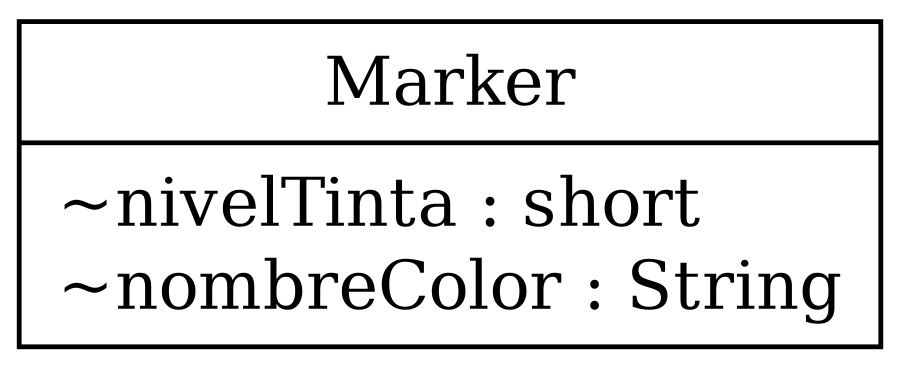
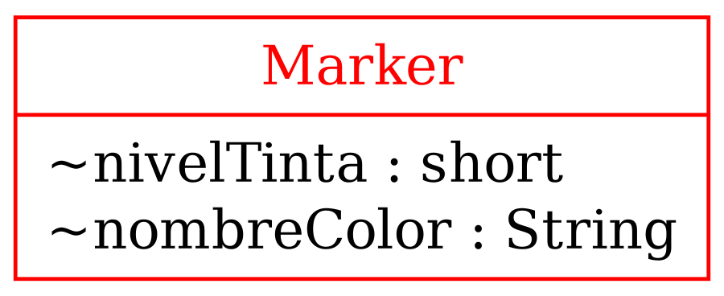

---
theme:
    override:
        code:
            theme_name: railsEnvy
        default:
            colors:
                background: "10141c"
---
<!-- column_layout: [2,3] -->
<!-- column: 0 -->
<!-- jump_to_middle -->
# **Intro Object Oriented Programming**

Mitsiu Alejandro Carreño Sarabia
<!-- column: 1 -->
<!-- jump_to_middle -->

<!-- reset_layout -->

<!-- end_slide -->

Agenda
---
├── Concepts      
├── Data types      
├── Magic Words?      
└── Intro POO      
&nbsp;&nbsp;&nbsp;&nbsp;├── Scenario    
&nbsp;&nbsp;&nbsp;&nbsp;└── Object Oriented Solution     
<!-- end_slide -->

# Concepts
---
**Programming paradigm**
1. A high level model to `conceptualize and structure` a computer program implementation 

**Implementation**
> The process of moving an idea `from concept to reality`

<!-- end_slide -->

## Data types
---
<!-- column_layout: [1,2] -->
<!-- column: 0 -->
**Primitives**
- byte = 0
- short = 0
- int = 0
- long = 0L
- float = 0.0f
- double = 0.0d
- boolean = false
- char = '\u0000'
<!-- column: 1 -->
**Non-primitives**      
- String = null;

- int[]
- float[]
- String[]
     
When do we use `new`?
<!-- pause -->
> new
> A Java keyword used to create an instance of a class. 
<!-- reset_layout -->
<!-- end_slide -->

#### Magic words?
---
<!-- jump_to_middle -->
What does the keywords in function main mean?

```java +line_numbers {all}
class Demo {
    public static void main(String[] args){
        ...
    }
}
```
<!-- end_slide -->

##### Intro POO
# Scenario
---
Our endgoal is to create an object like this:
<!-- pause --> 

<!-- column_layout: [1,2] -->
<!-- column: 0 -->

<!-- column: 1 -->
<!-- pause -->
```java +line_numbers {all}
<?>[] estuchePlumones = new <?>[4];
```

- What can **<?>** be?
<!-- reset_layout -->
<!-- end_slide -->

##### Intro POO
# Scenario
---
```java +line_numbers {all}
Marker[] estuchePlumones = new Marker[4];
```
<!-- column_layout: [1,2] -->
<!-- column: 0 -->

<!-- column: 1 -->

What properties (variables) should be in Marker?          
        
Or asked other way        
           
If Marker was a `database table` which could be it's columns?
<!-- reset_layout -->
<!-- end_slide -->

##### Intro POO
## Object Oriented Solution
---
We want to bind all our properties (nivelTinta, nombreColor) together as a single entity/object.

<!-- end_slide -->

##### Intro POO
## Object Oriented Solution
---
Let's focus on the red section
<!-- column_layout: [1,2] -->
<!-- column: 0 -->

<!-- column: 1 -->
- What's our name convetion for classes?
<!-- pause -->
```java +line_numbers {all}
class Marker {
   ... 
}
class E11IntroPoo{
    public static void main (
        String[] args
    ){...}
}
```
<!-- end_slide -->

##### Intro POO
## Object Oriented Solution
---
Finally let's complete our full class

<!-- end_slide -->

##### Intro POO
### Code up-to-date
---
```java +line_numbers {all}
class Marker {
    String nombreColor;
    short nivelTinta; 
}
class E11IntroPoo{
    public static void main (String[] args){
        ...
    }
}
```
<!-- end_slide -->

##### Intro POO
#### Class keyword
---
The `class` keyword allow to create a user-defined data type (just like int, boolean, float...) by giving it's `concrete implementation`.
<!-- pause -->
A template for `creating user-defined objects`.
<!-- pause -->
>class
>A type that defines the implementation of a `particular kind of object`.
      
      
What was implementation?
<!-- end_slide -->

##### Intro POO
##### Objects
---
We just `defined the object Marker` in our program.
     
How do we create a Marker variable?

- Hint 1:
<!-- pause -->
> new
> A Java keyword used to create an instance of a class.            

- Hint 2:
<!-- pause -->
\<type> \<nombreVar> = new \<type>();

<!-- end_slide -->

##### Intro POO
##### Objects
---
```java +line_numbers {all}
class Marker {
    String nombreColor;
    short nivelTinta;
}
class E11IntroPoo {
    public static void main(String[] args) {
        Marker marcadorBlanco = new Marker();
        marcadorBlanco.nombreColor="Blanco";
        marcadorBlanco.nivelTinta=100;
    }
}
```
<!-- end_slide -->

##### Intro POO
##### Objects
---
Let's analyze marcadorBlanco in jdb!
<!-- end_slide -->

##### Intro POO
##### Objects
---
Our endgoal was to create an object like this:

<!-- column_layout: [1,2] -->
<!-- column: 0 -->

<!-- column: 1 -->
<!-- pause -->
```java +line_numbers {all}
...
Marker[] estuchePlumones = 
    new Marker[4];

estuchePlumones[0] = marcadorBlanco;
...
```
<!-- end_slide -->

###### References
---
https://www.oracle.com/java/technologies/glossary.html
https://object-oriented-python.github.io/3_objects.html
https://docs.python.org/3/glossary.html
