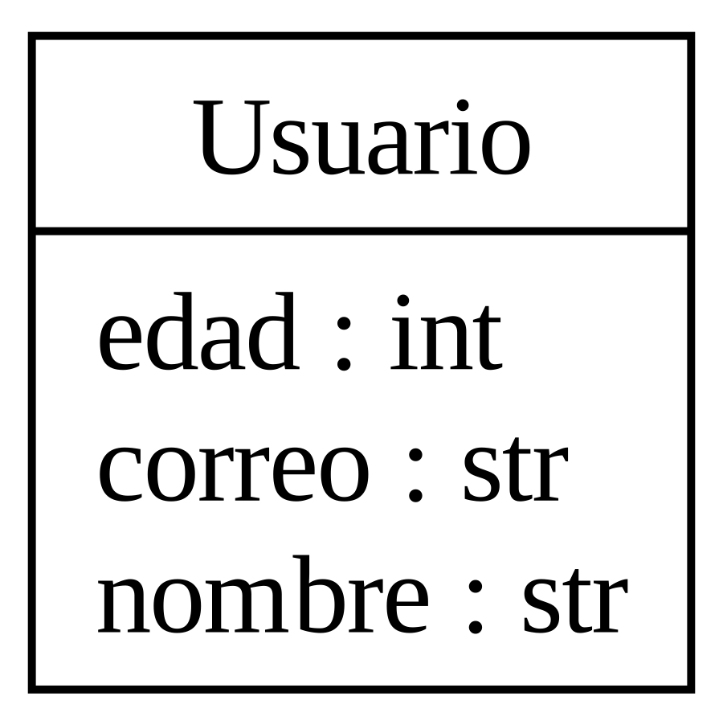
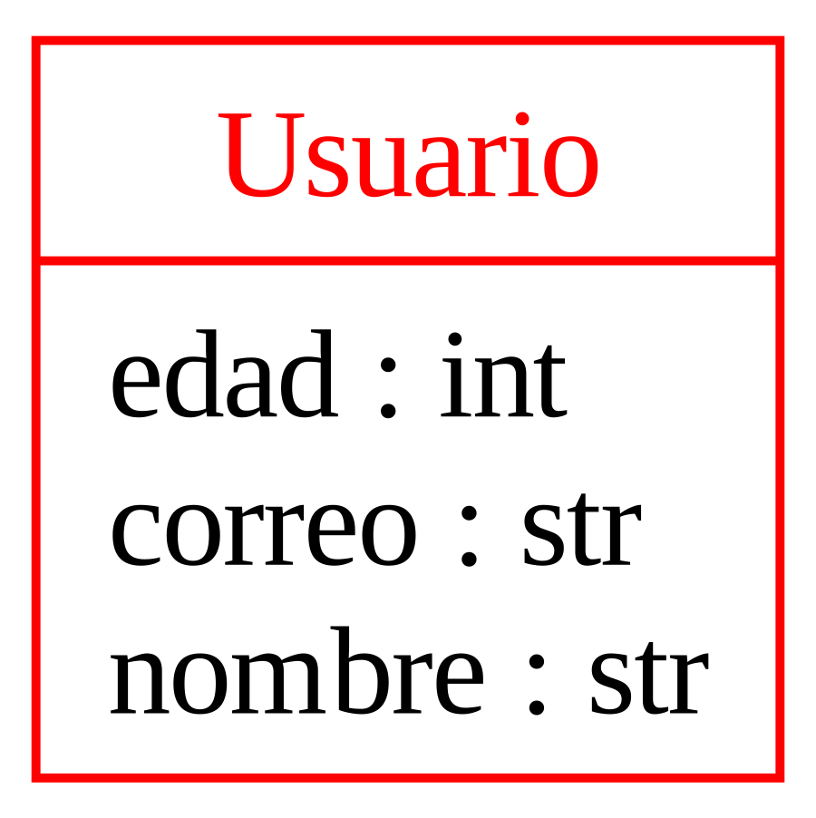

---
theme:
    override:
        code:
            theme_name: railsEnvy
        default:
            colors:
                background: "10141c"
---
<!-- column_layout: [2,3] -->
<!-- column: 0 -->
<!-- jump_to_middle -->
# **Intro Object Oriented Programming**

Mitsiu Alejandro Carreño Sarabia
<!-- column: 1 -->
<!-- jump_to_middle -->

<!-- reset_layout -->

<!-- end_slide -->

Agenda
---
└── Intro POO      
&nbsp;&nbsp;&nbsp;&nbsp;├── Scenario    
&nbsp;&nbsp;&nbsp;&nbsp;├── Object oriented solution     
&nbsp;&nbsp;&nbsp;&nbsp;└── Classes       
<!-- end_slide -->

# Concepts
---
**Programming paradigm**
1. A high level model to `conceptualize and structure` a computer program implementation 

**Implementation**
> The process of moving an idea `from concept to reality`

<!-- end_slide -->

## Data types
---
<!-- column_layout: [1,2] -->
<!-- column: 0 -->
**Primitives**
- byte = 0
- short = 0
- int = 0
- long = 0L
- float = 0.0f
- double = 0.0d
- boolean = false
- char = '\u0000'
<!-- column: 1 -->
**Non-primitives**      
- String = null;

- int[]
- float[]
- String[]
     
When do we use `new`?
<!-- pause -->
> new
> A Java keyword used to create an instance of a class. 
<!-- reset_layout -->
<!-- end_slide -->

#### Magic words?
---
<!-- jump_to_middle -->
What does the keywords in function main mean?

```java +line_numbers {all}
class Demo {
    public static void main(String[] args){
        ...
    }
}
```
<!-- end_slide -->

##### Intro POO
# Scenario
---
We want a program to store UPA personnel data (students, teachers, admins, etc), for each user we want:
- Name
- Age
- Email

<!-- pause -->
Does it scale well for `three users`?

<!-- end_slide -->

##### Intro POO
## Object oriented solution 
---
We want to bind all our properties (name, age, email) together as a single entity/object.

<!-- column_layout: [1,1] -->
<!-- column: 0 -->

<!-- column: 1 -->
Our endgoal is to group our attributes into a single object
```java +line_numbers {all}
persona1.nombre
persona1.edad
persona1.correo
```
<!-- reset_layout -->
<!-- end_slide -->

##### Intro POO
### Classes
---
Let's focus on the red section
<!-- column_layout: [1,2] -->
<!-- column: 0 -->

<!-- column: 1 -->
- What's our name convetion for classes?
<!-- pause -->
```java +line_numbers {all}
class Usuario {
   ... 
}
class E9IntroPoo{
    public static void main (
        String[] args
    ){...}
}
```
<!-- end_slide -->

##### Intro POO
### Classes
---
Finally lets complete our full class


<!-- end_slide -->
###### References
---
https://www.oracle.com/java/technologies/glossary.html
https://docs.oracle.com/javase/tutorial/java/nutsandbolts/arrays.html
