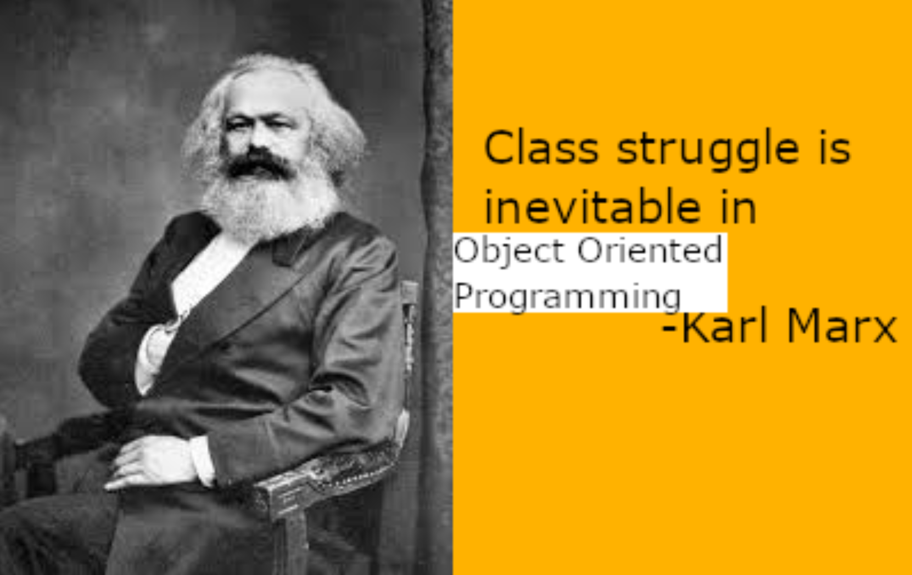
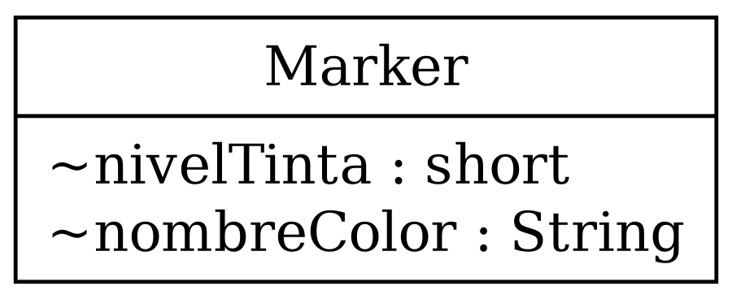
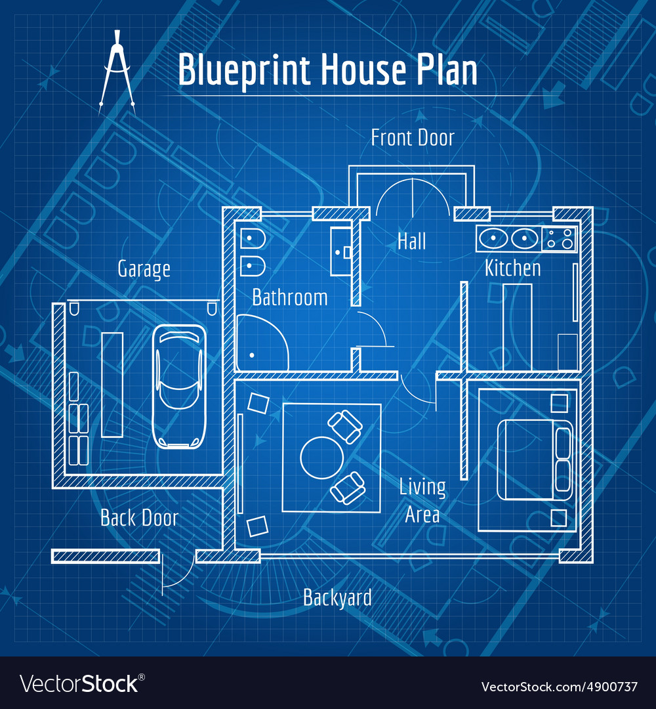
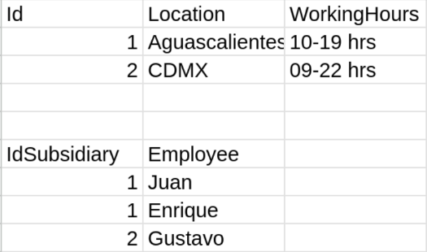
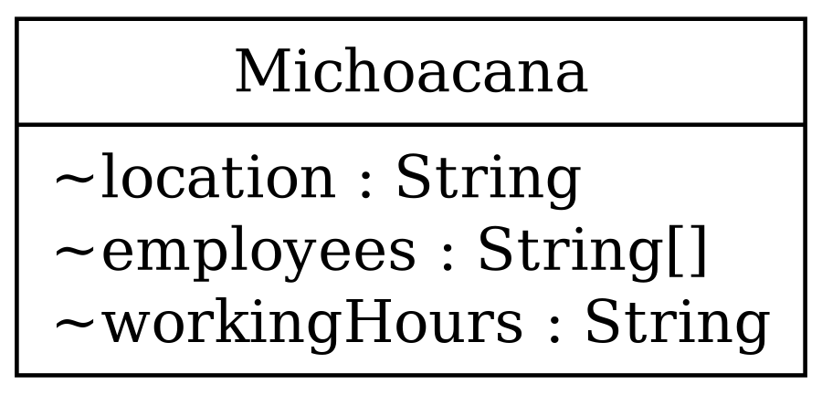
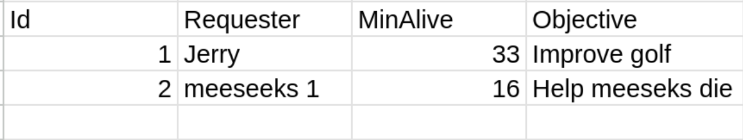
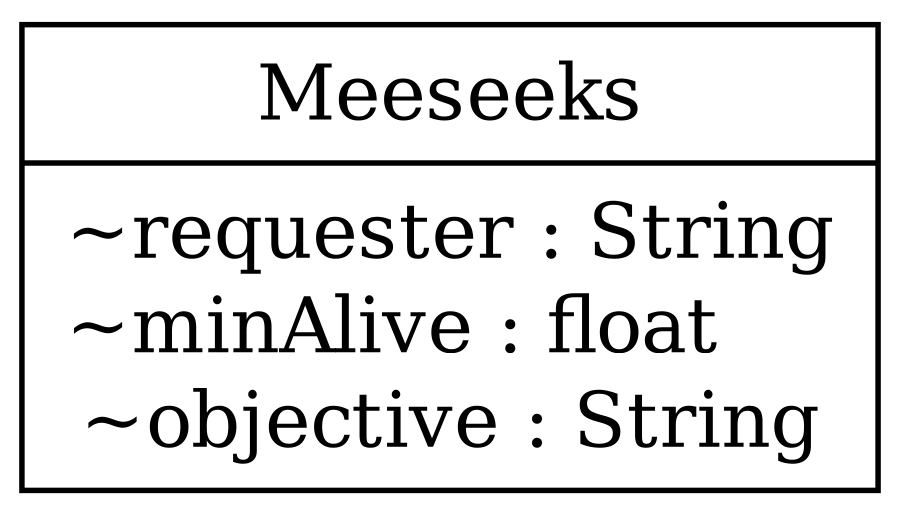

---
theme:
    override:
        code:
            theme_name: railsEnvy
        default:
            colors:
                background: "10141c"
---
<!-- column_layout: [1,3] -->
<!-- column: 0 -->
<!-- jump_to_middle -->
# **Clases & instances**

Mitsiu Alejandro Carreño Sarabia
<!-- column: 1 -->
<!-- jump_to_middle -->

<!-- reset_layout -->
<!-- end_slide -->

Agenda
---
├── Recap      
├── Instances      
├── Class vs Instances      
├── Real world instances      
│   ├── Physical World       
│   ├── Animated media        
│   └── Software      
└── Glossary      
<!-- end_slide -->

# Recap
---
1. We create a `custom (user-defined) data type`: 
<!-- pause -->
- - **class Marker**       
2. We bind several marker `properties (attributes/instance variables)` into our Marker object:
<!-- pause -->
- - **String nombreColor;**      
- - **short nivelTinta;**    


<!-- end_slide -->

# Recap
---
```java +line_numbers {all|1,7}
class Marker {
    String nombreColor;
    short nivelTinta;
}
class E11IntroPoo {
    public static void main(String[] args) {
        Marker marcadorBlanco = new Marker(); // <----
        marcadorBlanco.nombreColor="Blanco";
        marcadorBlanco.nivelTinta=100;
    }
}
```
<!-- end_slide -->

## Instances
---
\<tipoDato> \<nombreVariable> = new \<tipoDato>();      
> new
> A Java keyword used to create an instance of a class. 
```java +line_numbers {1,6}
class Marker {  // <------
    ...
}
class E11IntroPoo {
    public static void main(String[] args) {
        Marker marcadorBlanco = new Marker(); // <----
        ...
    }
}
```
<!-- end_slide -->

## Instances
---
Create a variable based on a class is known as an `object or an instance`, the verb is `instantiate`.
```java +line_numbers {1,6}
class Marker {  // <------
    ...
}
class E11IntroPoo {
    public static void main(String[] args) {
        Marker marcadorBlanco = new Marker(); // <----
        ...
    }
}
```
<!-- end_slide -->

## Instances
---
\<tipoDato> \<nombreVariable> = new \<tipoDato>();      
> new
> A Java keyword used to create an instance of a class. 
---
> instance
> An object of a particular class. In programs written in the Java programming language, an instance of a class is created using the new operator followed by the class name. 
<!-- end_slide -->

### Class vs Instance
---
<!-- column_layout: [1,1] -->
<!-- column: 0 -->
Is this a house?

<!-- column: 1 -->
<!-- pause -->
Is this a house?

<!-- pause -->
What's a blueprint usefull for?
<!-- reset_layout -->
<!-- end_slide -->

### Class vs Instance
---
<!-- column_layout: [1,1] -->
<!-- column: 0 -->
Is this a marker?
```java +line_numbers {1}
class Marker {  
    ...
}
class E11IntroPoo {
    public static void main(String[] args) {
        Marker marcadorBlanco = new Marker(); 
        ...
    }
}
```
<!-- column: 1 -->
Is this a marker?
```java +line_numbers {6}
class Marker {  
    ...
}
class E11IntroPoo {
    public static void main(String[] args) {
        Marker marcadorBlanco = new Marker();
        ...
    }
}
```
<!-- reset_layout -->
<!-- end_slide -->

### Class vs Instance
---
Functions have a similar nature:
```java +line_numbers {all}
int myFunc(){   -- This is a blueprint (implementation)
}

myFunc();       -- This is a physical house (execution)
```
<!-- pause -->
```java +line_numbers {all}
class Marker {  -- This is a blueprint (implementation)
}

new Marker();   -- This is a physical house (instance)
```
<!-- end_slide -->

### Class vs Instance
---
With a single blueprint (`class Marker`) we can create several `objects (instances)` 
- All have `the same instance variables` (nombreColor, nivelTinta)
- each has `it's own instance variables values` ([red, 100], [green, 70])
```java +line_numbers {all}
class Marker {  
    ...
}
class E11IntroPoo {
    public static void main(String[] args) {
        Marker marcadorBlanco = new Marker();
        Marker marcadorRojo = new Marker();
        Marker marcadorVerde = new Marker();
    }
}
```
<!-- end_slide -->

#### Real world instances
# Physical world
---
<!-- column_layout: [2,1] -->
<!-- column: 0 -->

<!-- column: 1 -->
All subsidiaries have this variables each has it's own values:
- Location
- Employees
- Working hours

<!-- reset_layout -->
<!-- end_slide -->

#### Real world instances
# Physical world
---
<!-- column_layout: [2,1] -->
<!-- column: 0 -->

<!-- column: 1 -->
All subsidiaries have this variables each has it's own values:
- Location
- Employees
- Working hours

<!-- reset_layout -->
<!-- end_slide -->

#### Real world instances
# Physical world
---
<!-- column_layout: [2,1] -->
<!-- column: 0 -->

<!-- column: 1 -->
All subsidiaries have this variables each has it's own values:
- Location
- Employees
- Working hours

<!-- reset_layout -->
<!-- end_slide -->

#### Real world instances
## Animated media
---
<!-- column_layout: [2,1] -->
<!-- column: 0 -->

<!-- column: 1 -->
All meeseeks have this variables each has it's own values:
- Requester
- MinAlive
- Objective

<!-- reset_layout -->
<!-- end_slide -->

#### Real world instances
## Animated media
---
<!-- column_layout: [2,1] -->
<!-- column: 0 -->

<!-- column: 1 -->
All meeseeks have this variables each has it's own values:
- Requester
- MinAlive
- Objective

<!-- reset_layout -->
<!-- end_slide -->

#### Real world instances
## Animated media
---
<!-- column_layout: [2,1] -->
<!-- column: 0 -->

<!-- column: 1 -->
All meeseeks have this variables each has it's own values:
- Requester
- MinAlive
- Objective

<!-- reset_layout -->
<!-- end_slide -->

#### Real world instances
### Software
---
<!-- column_layout: [1,2] -->
<!-- column: 0 -->
- Microsoft Word
- Videogames
<!-- column: 1 -->
Can you detect any blueprints and it's instance variables per instance?

<!-- reset_layout -->

<!-- end_slide -->

##### Glossary
----
Object = Instance            
Attribute = Instance variable
<!-- end_slide -->

##### Glossary
----
> class
> A type that defines the implementation of a particular kind of object.
---
> instance
> An object of a particular class. In programs written in the Java programming language, an instance of a class is created using the new operator followed by the class name.
---
> instance variable
> Any item of data that is associated with a particular object. Each instance of a class has its own copy of the instance variables defined in the class. Also called a field 
<!-- end_slide -->

###### References
---
https://www.oracle.com/java/technologies/glossary.html

